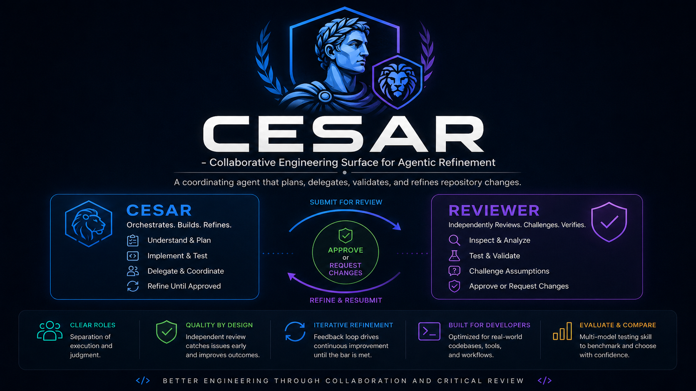
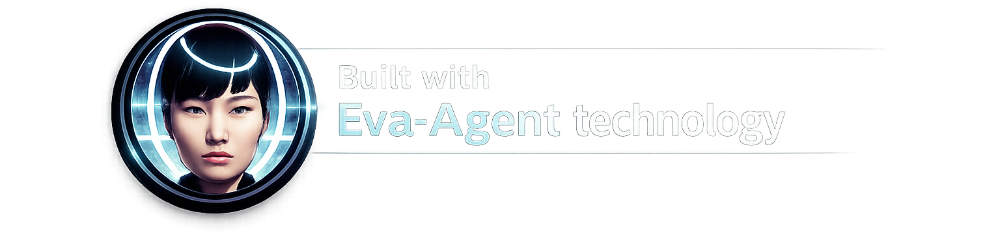

<p align="center">
	
</p>

# CESAR Agent

**Collaborative Engineering Surface for Agentic Refinement**

CESAR is a coordinating VS Code Copilot agent that plans, delegates, validates, and refines repository changes. It works with a focused reviewer agent when independent scrutiny adds value, not as a ritual on every task.

## Install

Paste this into Copilot Chat in the project you want to set up:

> Add CESAR, reviewer, and the agent-memory template to this project following https://github.com/appatalks/cesar-agent, then customize them for this project's goals, stack, and conventions.

Copilot installs the agents in `.github/agents/` and the optional memory starter in `.github/templates/agent-memory/`. CESAR can then copy the starter to `.agent-memory/` when the project needs durable memory.

## Agents

| Agent | Model | Responsibility |
|---|---|---|
| `@cesar` | GPT-5.6 Terra | Plans, delegates, implements, validates, and refines repository changes. |
| `@reviewer` | GPT-5.6 Sol | Independently reviews material risks, testing, research, citations, and consequential tradeoffs. |

Both agents use high reasoning effort and evidence-based confidence scores. A score of 90 or higher supports a well-verified conclusion; 70 to 89 calls for qualification or targeted verification; below 70 requires further investigation or consultation before a material decision.

## Workflow

1. Start with `@cesar` for most work.
2. CESAR investigates, implements, and runs focused verification.
3. CESAR consults `@reviewer` only for unresolved ambiguity, material risk, test gaps, research or citation accuracy, consequential tradeoffs, or insufficient confidence.
4. Reviewer returns `APPROVE`, `REQUEST CHANGES`, or `NEEDS DISCUSSION` with evidence and a confidence score.
5. CESAR resolves relevant findings and reports the final evidence.

Routine, low-risk, well-verified work does not need a reviewer call. Confirmed user direction remains the product decision; review identifies concrete defects and tradeoffs rather than reopening accepted choices.

## Context And Memory

Every material handoff uses a compact context packet: goal, decision, direct evidence, current state, assumptions and gaps, confidence, scope, and retrieval provenance. The receiving agent treats summaries and memory retrieval as leads to verify, not as ground truth.

Start new projects with versioned Markdown records. When retrieval needs grow, choose the smallest useful layer:

| Need | Recommended option |
|---|---|
| Small or new project | Files in `.agent-memory/records/` |
| Local full-text search | Optional [SQLite FTS5 index](.github/templates/agent-memory/sqlite) |
| Vocabulary mismatch | Vector retrieval with record and source IDs |
| Repeated multi-hop questions | Graph retrieval derived from the same records and relationships |

Markdown records remain authoritative. Indexes, vectors, and graph stores are derived retrieval layers that must return source references, query details, freshness, conflicts, omissions, and failures.

## Customize

Change a profile's `model:` field to choose another available Copilot model or provide fallbacks:

```yaml
model: ['GPT-5.6 Terra (copilot)', 'GPT-5.6 Sol (copilot)']
```

Include a role in the installation request to tune the workflow for your domain:

> Add CESAR, reviewer, and the agent-memory template from https://github.com/appatalks/cesar-agent, then optimize the agents for my role as a **{your role}**.

| Role | CESAR and reviewer emphasis |
|---|---|
| Teacher | Readable examples, clear naming, and pedagogical fit. |
| Security Researcher | Threat modeling, exploitability, and adversarial test coverage. |
| Accountant | Data integrity, auditability, decimal precision, and financial edge cases. |
| Microsoft Support | Compatibility, diagnostics, supportability, and actionable error messages. |
| GitHub Sales | Demo readiness, customer-facing polish, and presentation risk. |

Any role or domain works; use the language your team already uses.

---

## Built With Eva-Agent

This project was created with technology developed in [Eva-Agent](https://github.com/appatalks/eva-agent/).

<p align="center">
	<a href="https://github.com/appatalks/eva-agent/"></a>
</p>
